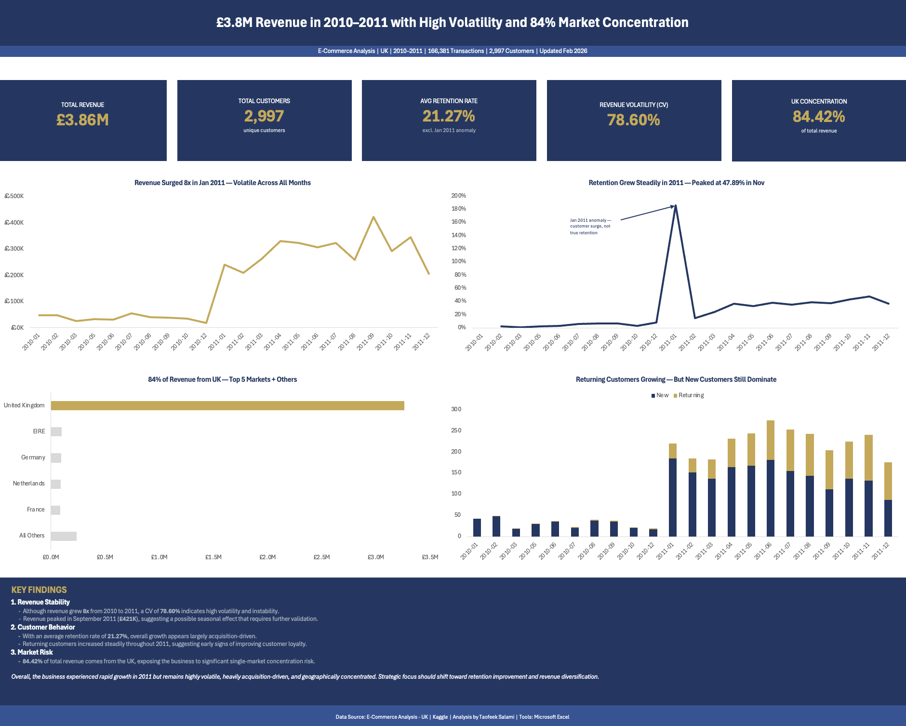

# Customer Retention & Revenue Stability Analysis

---

## Executive Summary

This project analyses customer retention patterns and revenue stability for a UK-based e-commerce retailer using transactional data from 2010 to 2011. The cleaned dataset comprises 166,381 transactions across 2,997 unique customers spanning 33 countries. While revenue increased approximately 8x year-over-year, growth was primarily acquisition-driven and accompanied by substantial volatility. Key structural risks identified include a 78.60% coefficient of variation in monthly revenue and an 84.42% revenue concentration in the United Kingdom, indicating limited geographic diversification.

---

## Performance Snapshot

| Metric | Value |
|---|---|
| Total Revenue | £3,865,463.08 |
| Total Customers | 2,997 |
| Total Transactions | 166,381 |
| Avg Monthly Revenue | £175,702.87 |
| Avg Retention Rate | 21.27% |
| Revenue Volatility (Coefficient of Variation) | 78.60% |
| UK Revenue Share | 84.42% |
| Analysis Period | Jan 2010 — Dec 2011 (22 active months) |

> The business experienced rapid growth but exhibited high volatility, low retention, and significant geographic concentration risk.

---

## Objective

To analyse customer retention dynamics, revenue stability, and geographic concentration exposure for a UK-based e-commerce retailer over a 22-month period. The objective is to assess whether observed growth was structurally sustainable or primarily acquisition-driven, identify key operational and market risks, and translate findings into data-backed strategic recommendations using a structured Excel-based analytical workflow.

---

## Business Context

E-commerce businesses heavily concentrated in a single dominant market face elevated structural risk, particularly when revenue growth is driven primarily by new customer acquisition rather than repeat purchasing. For a retailer generating £3.86M across 166,381 transactions, assessing revenue stability and customer concentration is essential for sustainable scaling. This analysis equips business owners, commercial leaders, and investors with quantitative insight to inform retention strategy, geographic diversification, and revenue forecasting decisions.

---

## Business Questions

This analysis was structured around five core business questions:

1. Is observed revenue growth structurally sustainable, or primarily driven by continuous new customer acquisition?
2. How stable is monthly revenue performance, and what does observed volatility imply for forecasting reliability?
3. Is the customer base demonstrating strengthening loyalty, or does churn remain the dominant behavioural pattern?
4. How concentrated is revenue across geographic markets, and what systemic exposure does this create?
5. Are there data anomalies or outliers that materially distort retention or revenue metrics?

---

## Analysis Approach

The analysis was conducted entirely in Microsoft Excel using a structured 10-phase workflow. Raw transactional data was imported and transformed via Power Query, followed by systematic cleaning to remove duplicates, null values, returns, and date inconsistencies.

Ten core KPIs were defined across three analytical pillars: Customer, Revenue, and Risk. Metrics were computed using PivotTables, structured table formulas, and helper columns to ensure traceability and reproducibility.

Retention was calculated using a month-over-month methodology based on active customer counts. Revenue stability was evaluated through growth rate tracking, standard deviation, and coefficient of variation analysis. Geographic concentration exposure was quantified by segmenting revenue and customer distribution by country and applying a structured risk classification.

All results were consolidated into an executive dashboard and synthesised into five structured business insights addressing growth sustainability, retention dynamics, customer composition, market concentration, and anomaly detection.

---

## Key Findings

1. Revenue grew approximately 8x year-over-year — from an average of £36K per month in 2010 to £292K in 2011 — but a coefficient of variation of 78.60% confirms the growth was highly unstable, with monthly revenue fluctuating between £17K and £421K.

2. Average retention rate of 21.27% (excluding the January 2011 anomaly) indicates growth was largely acquisition-driven. The implied churn rate of approximately 78.73% suggests most customers did not return after their initial purchase.

3. Returning customers grew 40–50x — from 1–3 per month in early 2010 to 88–108 per month by late 2011 — representing approximately 45% of active customers by November 2011, indicating early signs of loyalty development.

4. 84.42% of total revenue and 90.52% of customers are concentrated in the United Kingdom. The second-largest market, EIRE, contributes only 2.52%, confirming extreme single-market dependency with no meaningful secondary market presence.

5. January 2011 recorded an anomalous retention rate of 186.29% — a mathematical impossibility driven by a sudden customer surge from 19 to 221 active customers. This outlier was excluded from all retention calculations to preserve analytical accuracy.

---

## Business Implications

## Recommendations

## Strategic Outlook

## Process

## Methodology & Tools

## Data Source
